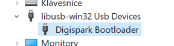

# Cima attiny85

A basic program for attiny 85 to demonstrate Aurduino-less development for this tiny board with processor.

# About ATTINY85

[SoC Atmel 1705 TINY85 20SU](https://www.microchip.com/en-us/product/ATTINY85) is: 
- [AVR based](https://en.wikipedia.org/wiki/AVR_microcontrollers) 8-bit microprocessor 
- 8KB of flash memory 
- 512 B SRAM
- 6 GPIO (HW PWM, AD converter)
- [Complete TINY85 datasheet](https://ww1.microchip.com/downloads/en/devicedoc/atmel-2586-avr-8-bit-microcontroller-attiny25-attiny45-attiny85_datasheet-summary.pdf)

[Digispark Breakout board](http://digistump.com/wiki/digispark) is:
- Opensource PCB layout
- With micro USB
- 5V stabilization
- 6 Breakout GPIO pins
- 3 power in/out pins
- TINY85's flash is preloaded with [bootloader Micronucleus](https://github.com/micronucleus/micronucleus) that makes it possible to laod main program via USB

# Development

## Prereqisities

### 1. USB-COM drivers: [Digistump.Drivers.zip](https://github.com/digistump/DigistumpArduino/releases/download/1.6.7/Digistump.Drivers.zip)
>__NOTE:__ Find the latest release at https://github.com/digistump/DigistumpArduino/releases/
- Unzip anywhere
- Install using _Install Drivers.exe_
- Plug in your ATTINNY 85 board
- 

### 2. GCC-AVR toolchain alternatives

1. [GCC-AVR toolchain opensource 11.1.0 x64 win](https://blog.zakkemble.net/download/avr-gcc-11.1.0-x64-windows.zip)
    - >__NOTE:__ find the most up to date compilers at https://blog.zakkemble.net/avr-gcc-builds/
    - unzip to dedicated folder somwhere where you store your compilers
    - You will need to reference this folder multiple times in your project

2. [GCC-AVR toolchain from microchip](https://ww1.microchip.com/downloads/Secure/en/DeviceDoc/ARM-GNU-Toolchain-6.3.1-src.zip) (registration needed)
    - >__NOTE:__ find the most up to date compilers at https://www.microchip.com/en-us/tools-resources/develop/microchip-studio/gcc-compilers

### 3. [AVR DUDE](https://www.nongnu.org/avrdude/)
- A tool for uploading and downloading compiled binary to TINY85 microchip
>__NOTE:__ ISP = in-system programming; a technique to upload your code

### 4. [Micronucleus](https://github.com/micronucleus/micronucleus) 
an USB emaulating bootloader that has a counterpart on PC operating system allowing you to upload your program

- Download [micronucleus-cli-master-882e7b4a-x86_64-MINGW64_NT-10.0-17763.zip](https://github.com/micronucleus/micronucleus/releases/download/v2.6/micronucleus-cli-master-882e7b4a-x86_64-MINGW64_NT-10.0-17763.zip)
- >__NOTE:__ [latest releases](https://github.com/micronucleus/micronucleus/releases)
- unzip it like you did with AVR-GCC somwhere comfortable for you to reference it within Your project

### 5. CMAKE

# Upgrading micronucleus

Pretty nice article (https://www.iot-experiments.com/micronucleus-bootloader-upgrade/) gives a good description of how to upgrade your Digispark to the latest version.

1. Download latest HEX representation of [the micronucleus firmware](https://github.com/micronucleus/micronucleus/tree/v1.11/upgrade/releases) e.g. _micronucleus-1.11-upgrade.hex_ 

2. Unplug device

3. Run 
```
micronucleus.exe --run micronucleus-1.11-upgrade.hex
```

4. Plug in your device

5. Upgrade tkaes a moment

6. Done!

## More on upgrading

- https://gist.github.com/Ircama/22707e938e9c8f169d9fe187797a2a2c